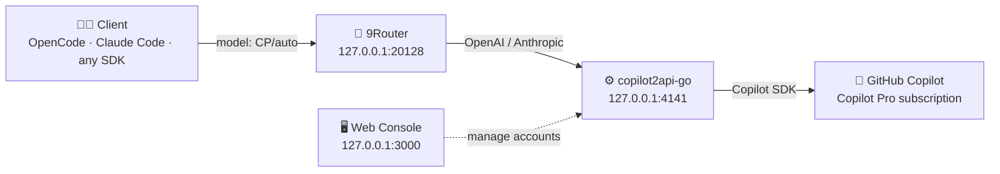

<div align="center">

# 🚀 copilot2api-go-setup

**Turn your GitHub Copilot subscription into a self-hosted, OpenAI & Anthropic-compatible API endpoint — on Windows, in minutes.**

Complete setup kit: `source + docs + templates` for running copilot2api-go behind your own router (9Router), with auto model routing, multi-account pooling, and boot-time autostart.

[](https://go.dev/dl/)
[](#-license)
[](#-quickstart)
[](https://github.com/StarryKira/copilot2api-go)

</div>

---

## 📖 Table of Contents

- [✨ Features](#-features)
- [🏗 Architecture](#-architecture)
- [⚡ Quickstart](#-quickstart)
- [🎛 `auto` Model Routing](#-auto-model-routing)
- [💰 Pricing & Limits](#-pricing--limits)
- [🔌 9Router Integration](#-9router-integration)
- [🪟 Windows Autostart](#-windows-autostart)
- [🔐 Security](#-security)
- [❓ FAQ](#-faq)
- [📄 License & Acknowledgements](#-license--acknowledgements)

---

## ✨ Features

| | |
|---|---|
| ✅ **OpenAI-compatible** | `/v1/chat/completions` — drop-in for any OpenAI SDK / client |
| ✅ **Anthropic-compatible** | `/v1/messages` — Claude Code ready, native streaming events |
| ✅ **Full streaming** | SSE chunk-by-chunk, both protocols |
| ✅ **`auto` model routing** | GitHub's smart model selection — routes each task to the most efficient model |
| ✅ **47+ premium models** | `claude-opus-5`, `gpt-5.6-sol`, `gemini-3.6-flash`, `kimi-k3`, … |
| ✅ **Multi-account pool** | Load-balance across Copilot accounts from the web console |
| ✅ **9Router integration** | Route `CP/*` alongside ZenProxy, Freebuff, Pollinations … |
| ✅ **Windows autostart** | Hidden boot launch via VBS + BAT templates |
| ✅ **Token refresh** | Automatic, background — no manual re-auth |

---

## 🏗 Architecture



---

## ⚡ Quickstart

### Prerequisites

- [Go](https://go.dev/dl/) ≥ 1.22
- [Node.js](https://nodejs.org/) *(for the `@github/copilot` CLI)*
- An active GitHub **Copilot subscription** (Pro / Pro+ / Max — [Free has limits](#-pricing--limits))

### 1 · Clone & build

```bash
git clone https://github.com/apissaj/copilot2api-go-setup.git
cd copilot2api-go-setup/src
go build -o copilot-go.exe .
```

### 2 · Install the Copilot CLI (required by instances)

```bash
npm install -g @github/copilot
```

### 3 · Run the server

```bash
copilot-go.exe --web-port 3000 --proxy-port 4141
```

### 4 · Connect your Copilot account

1. Open **http://localhost:3000** — set up your admin account
2. **Add account** → choose *GitHub OAuth (device flow)*
3. Open **https://github.com/login/device** and enter the displayed code
4. Approve — the account connects and the instance starts automatically

### 5 · Test it

```bash
# OpenAI-compatible
curl http://localhost:4141/v1/chat/completions \
  -H "Authorization: Bearer YOUR_API_KEY" \
  -H "Content-Type: application/json" \
  -d '{"model":"auto","messages":[{"role":"user","content":"Hello!"}]}'

# Anthropic-compatible (Claude Code)
curl http://localhost:4141/v1/messages \
  -H "Authorization: Bearer YOUR_API_KEY" \
  -H "Content-Type: application/json" \
  -H "anthropic-version: 2023-06-01" \
  -d '{"model":"auto","messages":[{"role":"user","content":"Hello!"}],"max_tokens":100}'
```

**✅ Done — you now have a self-hosted Copilot API endpoint.**

---

## 🎛 `auto` Model Routing

`auto` isn't a model — it's **GitHub's intelligent model router**. It evaluates **task complexity** and **real-time system health**, then routes each request to the best available model:

- 🧠 Hard tasks → strong reasoning models
- ⚡ Easy tasks → fast, cheap models
- 🛡 **Reduced rate-limiting** (picks healthy/available models)
- 💸 **10% discount** on model costs for paid plans

> **Tip** — use `CP/auto` as your daily default; reserve explicit premium models (`claude-opus-5`, `gpt-5.6-sol`) for heavy reasoning work.

---

## 💰 Pricing & Limits

GitHub Copilot **Pro** ($10/mo) includes **1,500 AI credits/month** (1,000 base + 500 flex). `1 credit = $0.01` — every request draws from this budget based on model + tokens.

| Model | Input / Output (per 1M tok) | ~Requests / month (4k in / 500 out) |
|---|---|---|
| `auto` *(GPT-5 mini — cheapest)* | $0.25 / $2.00 | **~7,500** |
| `gemini-3.6-flash` | $1.50 / $7.50 | ~1,500 |
| `claude-sonnet-5` | $2.00 / $10.00 | ~1,150 |
| `gpt-5.6-terra` | $2.00 / $12.00 | ~1,070 |
| `claude-opus-5` | $5.00 / $25.00 | ~460 |
| `gpt-5.6-sol` | $5.00 / $30.00 | ~430 |

> 🔋 Run out? GitHub offers **pay-as-you-go** top-ups — the endpoint keeps working, no hard stop.
> 💡 Cached context costs ~90% less — long sessions in one thread are cheap.

---

## 🔌 9Router Integration

Wire Copilot into 9Router (local smart router at `127.0.0.1:20128`) so `CP/*` routes alongside your other providers:

| Field | Value |
|---|---|
| **Prefix** | `CP` |
| **BaseURL** | `http://localhost:4141/v1` |
| **API Key** | from the copilot2api-go web console |
| **Models** | `auto`, `claude-opus-5`, `claude-sonnet-5`, `gpt-5.6-sol`, … |

```bash
curl http://127.0.0.1:20128/v1/chat/completions \
  -H "Authorization: Bearer 9ROUTER_KEY" \
  -H "Content-Type: application/json" \
  -d '{"model":"CP/auto","messages":[{"role":"user","content":"Hello!"}]}'
```

Full DB-level integration guide (providerNodes, providerConnections, `customModels` registry, restart procedure, pitfalls): **[docs/9router-integration.md](docs/9router-integration.md)**

---

## 🪟 Windows Autostart

Templates in [`templates/`](templates/) — proven to work, hidden at boot:

| File | Role |
|---|---|
| `start-copilot.bat` | Sets PATH (for `copilot` CLI), starts binary, logs to `copilot-go.log` |
| `autostart.vbs` | Launches the BAT hidden — drop into `shell:startup` |

**Verified live**: BAT resolves `%~dp0` from any cwd, redirect & PATH work, VBS triple-quote `WshShell.Run` launches correctly (tested via `cscript`).

> ⚠️ The `copilot` CLI shim lives outside the default Windows PATH (e.g. `%LOCALAPPDATA%\hermes\node`). The template sets it explicitly — don't remove that line.

---

## 🔐 Security

- 🔒 **No secrets in this repo** — API keys live in `~/.local/share/copilot-api/` (outside the repo) and are never committed
- 🚫 Don't commit: `accounts.json`, `admin.json`, `copilot-go.log`, `*.exe`
- 🎫 OAuth device-flow tokens are scoped to the Copilot app — revocable anytime from GitHub settings
- 🛡 Rate limiter is **off by default** (`RATE_LIMIT_RPM`) — enable via web console if needed
- 🔄 Token refresh is automatic & background

---

## ❓ FAQ

**Is this against GitHub ToS?**
Review GitHub's terms yourself. This uses your own paid Copilot subscription via the official public API surface. Use responsibly — the account owner is responsible for the account.

**Can I add multiple Copilot accounts?**
Yes — web console → *Add account* → the pool load-balances across them (great for spreading credit usage).

**What happens when credits run out?**
Requests fail with a billing error until you top up (pay-as-you-go) or the monthly cycle resets. Monitor usage at `github.com/settings/copilot`.

**Is the bundled source kept up to date?**
`src/` is a snapshot of [`StarryKira/copilot2api-go`](https://github.com/StarryKira/copilot2api-go) at commit `4b913d5` (Jul 5 2026). Re-sync manually, or open an issue to add an auto-sync workflow.

---

## 📄 License & Acknowledgements

- **Docs & templates**: MIT © apissaj
- **Source (`src/`)**: MIT © haruka / StarryKira — from [`StarryKira/copilot2api-go`](https://github.com/StarryKira/copilot2api-go)

Built on the work of [StarryKira/copilot2api-go](https://github.com/StarryKira/copilot2api-go) — *"Turn GitHub Copilot into OpenAI/Anthropic API compatible server."*

<p align="center"><sub>Made with ❤️ for the self-hosted AI community.</sub></p>